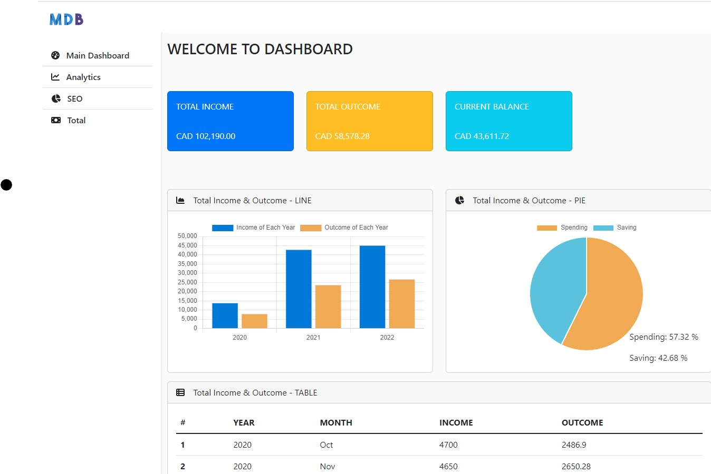

# Income Dashboard

## Introduction
<p>This is a Dashboard web application. 
The based data is about the monthly income dataset.
The dashboard will show various types of charts, 
for instance, pie charts, line charts, etc. 
Also, it will represent the total annual income.</p>



## Development Tools
* python flask
```
pip install flask
```
* bootstrap, bootstrap-table, fontawesome icon, chartjs, jQuery
```
https://cdn.jsdelivr.net/npm/bootstrap@5.2.0/dist/css/bootstrap.min.css
https://cdn.jsdelivr.net/npm/bootstrap-icons@1.9.1/font/bootstrap-icons.css
https://cdnjs.cloudflare.com/ajax/libs/Chart.js/3.9.1/chart.min.js
https://unpkg.com/bootstrap-table@1.21.0/dist/bootstrap-table.min.css
https://unpkg.com/bootstrap-table@1.21.0/dist/bootstrap-table.min.js
https://cdn.jsdelivr.net/npm/jquery/dist/jquery.min.js

your fontawsome kits
```
* Reference:
```
https://getbootstrap.com/docs/5.2/getting-started/introduction/
https://fontawesome.com/
https://bootstrap-table.com/
https://www.chartjs.org/
```
## Development Notes

### Initialization
* Visualized the sample page of web application.
* Import bootstrap style and fontawesome icon into html file.
* Import chartjs in order to show various types of chart.
* Set the sample dataset for the charts.
* Using Bootstrap-table, displays easy and simple.

### Datasets
* Import dataset from csv file - using pandas library
* Reshaping Data 
* Changing to import dataset method - csv file -> sqlalchemy 

## Issues
* Resizing chart
* Overflows table and pie chart
* Needs more detail data in order to analyze it in detail